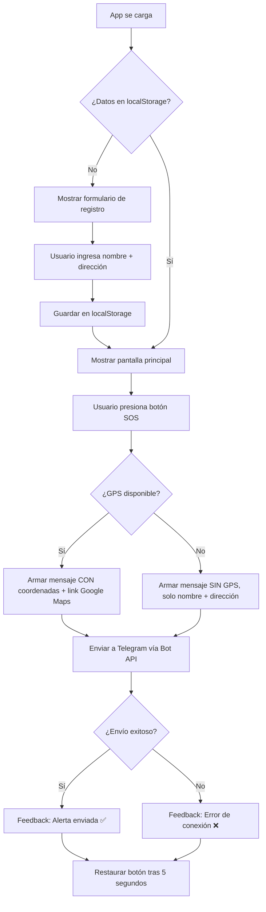

# 🚨 Botón de Pánico PWA — Walkthrough

## Resumen

PWA completa de emergencia para comerciantes y adultos mayores. Permite enviar alertas con geolocalización directamente a un grupo de Telegram.

---

## Archivos Creados

| Archivo | Propósito |
|---------|-----------|
| [index.html](file:///c:/Users/marce/Desktop/App-Boton-Panico/index.html) | Estructura HTML con dos pantallas (registro + pánico) |
| [styles.css](file:///c:/Users/marce/Desktop/App-Boton-Panico/styles.css) | Diseño mobile-first, modo oscuro, alto contraste |
| [app.js](file:///c:/Users/marce/Desktop/App-Boton-Panico/app.js) | Lógica: localStorage, geolocalización, API Telegram |
| [manifest.json](file:///c:/Users/marce/Desktop/App-Boton-Panico/manifest.json) | Manifest PWA para instalación nativa |
| [service-worker.js](file:///c:/Users/marce/Desktop/App-Boton-Panico/service-worker.js) | Caché offline, estrategia Network First |
| `icons/` | 8 tamaños de ícono (72px a 512px) |

---

## Capturas de Pantalla

````carousel
### Pantalla de Registro (Onboarding)
Al abrir por primera vez, se muestra el formulario para ingresar nombre/comercio y dirección.


<!-- slide -->
### Pantalla Principal (Botón de Pánico)
Una vez registrado, se muestra el botón SOS con indicador de estado activo y datos del usuario.


````

---

## Flujo de la Aplicación



---

## ⚙️ Configuración Obligatoria

> [!IMPORTANT]
> Antes de usar la app, debés configurar las credenciales de Telegram en [app.js](file:///c:/Users/marce/Desktop/App-Boton-Panico/app.js#L14-L15):

```javascript
const BOT_TOKEN = 'TU_BOT_TOKEN_AQUI';   // Obtener de @BotFather en Telegram
const CHAT_ID   = 'TU_CHAT_ID_AQUI';     // ID del grupo de Telegram
```

### Cómo obtener los valores:

1. **BOT_TOKEN**: Hablar con [@BotFather](https://t.me/BotFather) en Telegram → `/newbot` → copiar el token
2. **CHAT_ID**: Agregar el bot al grupo → enviar un mensaje → visitar `https://api.telegram.org/bot<TOKEN>/getUpdates` → buscar el `chat.id` (negativo para grupos)

---

## 🚀 Despliegue en GitHub Pages

```bash
# 1. Inicializar repositorio
git init
git add .
git commit -m "Botón de Pánico PWA v1.0"

# 2. Crear repo en GitHub y subir
git remote add origin https://github.com/TU_USUARIO/boton-panico.git
git push -u origin main

# 3. Activar GitHub Pages
# Ir a Settings → Pages → Branch: main → Save
```

> [!TIP]
> El Service Worker requiere HTTPS para funcionar. GitHub Pages lo provee automáticamente.

---

## Características Implementadas

- ✅ **PWA instalable** con manifest.json y service worker
- ✅ **Modo oscuro** con alto contraste para accesibilidad
- ✅ **Botón de pánico gigante** con animaciones de pulso
- ✅ **Geolocalización** con enlace directo a Google Maps
- ✅ **Fallback sin GPS** — envía alerta igual con dirección registrada
- ✅ **Vibración háptica** en dispositivos compatibles
- ✅ **Feedback visual** con animación de onda expansiva
- ✅ **Datos persistentes** en localStorage
- ✅ **Edición de datos** desde el botón de engranaje
- ✅ **Código comentado en español**
- ✅ **Accesibilidad**: aria-labels, prefers-reduced-motion, inputs de 44px+
